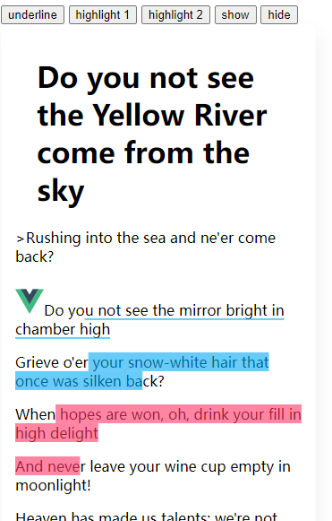

# mark-highlight(beta)

Languages: 简体中文 | [English](/README.md)


`mark-highlight`是一个简单轻量的内容选中划线高亮小工具。

- 保留元素的内部结构
- 对于选中区域的标记操作，有很简单的数据符号，方便下次访问时再次渲染绘制选中区域，前提是内容不变的情况下。
- 适用于笔记、博客、电子书、批注等场景。



- 支持下划线 高亮类型的标记
- 支持标记区域点击事件
- 支持标记区域设置自定义类名
- 支持视图更新标记区域同步更新

### demo

[示例代码](./examples/index.html)

[在线演示](https://code.juejin.cn/pen/7171034100965310472)

如果感觉还不错的话，来个star~

### 安装

```html
<script src="../dist/index.umd.js"></script>
```

or

```bash
npm install mark-highlight
```


### 使用

```js
 let mark = new Mark("idName"|HtmlElement);
 mark.render();
```

**回调**
```js
mark.on('render', (el) => {
    console.log('render dom',el);
})
mark.on('selected', (data) => {
    let markStr = data.markStr;
    let {
        top_left,
        top_center,
        top_right,
        // ...
    } = data.position;
})
```

**设置高亮**

```js
mark.highlight(markStr, 'className', (e) => {
    // 高亮区域点击后回调
    // 获取点击元素的_rangeStr
    let _markStr = e.target.getAttribute('data-id')
   
})
```
**设置下划线**
```js
mark.underline(markStr, 'className', (e) => {
    let _markStr = e.target.getAttribute('data-id')
})
```

**删除标记**

```js
mark.remove(markStr, 'underline|highlight');
```

**添加标记**

```js
mark.add({
    markStr:"",
    type: 'underline|highlight',
    className: "",
    data: {},
    clirk:()=>{},

});
```

**显示所有**
```js
mark.show();
```

**隐藏所有**
```js
mark.hide();
```

**清空标记**
```js
mark.clear();
```

**获取所有标记**
```js
mark.getMarks();
```
